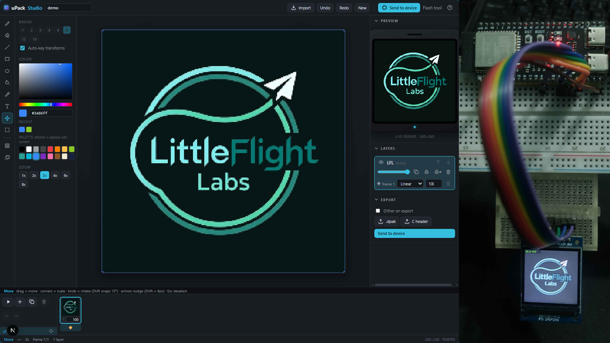

# uPack Studio 
## Animator and Base Firmware for MCU display
[](https://github.com/Faysal-star/upak-studio)

uPack (micro pack) Studio is an asset pack pipeline built on an ESP32-S3 with a 240×240 ST7789 display. A browser studio lets you
draw and animate artwork, preview it exactly as the device will render it, and send it to the device over USB in a
few seconds, with no drivers and no reflashing. The device shows a procedural animated face and runs small scenes
(a Snake game is included).

*This repository is a minimal public slice of a larger private codebase. It contains the parts that are stable and
verified on hardware: the base firmware, the web studio with its uploader and flasher, and the asset format with its
reference encoder. The rendering research built on top of this platform is part of a manuscript in preparation and is
not included here.*

## What is in this repository

| Path | What it is |
|---|---|
| `firmware/` | Base firmware for the ESP32-S3 (PlatformIO, Arduino core, LovyanGFX): DPAK asset loader, procedural face engine, hardware abstraction layer (touch, events, capabilities), Snake scene, and the serial asset-upload receiver |
| `tools/animator/` | Web studio (Next.js, TypeScript): pixel editor, layers, text, animation timeline, device-accurate preview, DPAK export, **Send to device** over Web Serial, and a browser firmware flasher (esptool-js) |
| `tools/dpak-cli/` | Reference DPAK encoder and inspector (Node.js), golden fixtures, and a PowerShell reference host for the upload protocol |
| `docs/asset-format-dpak.md` | DPAK v1: the binary asset-pack format shared by the firmware, the CLI and the studio |
| `docs/upload-protocol.md` | DPAK-UPLOAD v1: the chunked, CRC-checked serial protocol the studio uses to send packs to the device |

Three independent implementations of DPAK (C decoder, Node encoder, TypeScript encoder/reader) are kept
byte-compatible and cross-checked against the same golden fixtures.

## Hardware

- ESP32-S3-DevKitC-1 (tested on an N16R8 module)
- ST7789 240×240 SPI display (GMT130, 7-pin, no CS); pins are in `firmware/src/lgfx_deskpet.hpp`

## Build and flash the firmware

```bash
cd firmware
pio run -e esp32s3-usb -t upload      # firmware, native USB port
pio run -e esp32s3-usb -t uploadfs    # assets (demo.dpak, face.dpak) to LittleFS
pio test -e native                    # host-side unit tests
```

The device answers `INFO` on the serial console with its firmware version.

## Run the studio

```bash
cd tools/animator
npm install
npm run dev        # http://localhost:3000; the flasher is at /flash
npm test
```

Draw or import artwork, then use **Send to device** (Chrome or Edge, Web Serial). The pack is streamed in
CRC-checked chunks, written atomically on the device, and hot-reloaded on the display.

## Verification

- Firmware: 4 native test suites (DPAK decoder with golden fixtures, face engine, HAL, Snake); the `esp32s3-usb`
  image is the one verified on the device (462,205 B flash, 27,716 B RAM).
- Studio: 43 unit tests (DPAK writer/reader parity with the golden fixtures, LZ4, compositing, CRC).
- CLI: golden-fixture round trips.

## History

The project started on 2026-08-29. This repository was assembled on 2026-09-23 from the private codebase; its
commits are dated to the day each component was first built, as recorded in the project log, and the file contents
are the verified state of 2026-09-23.

## License

MIT, see [LICENSE](LICENSE). Third-party dependencies (LovyanGFX, Next.js, React, esptool-js and others) keep their own licenses.

## Citation

If you use this code or build on it, please cite it as:

> Faysal Mahmud. *uPack Studio: base firmware and web studio for a microcontroller desk companion display*, version 0.3.0, 2026. https://github.com/Faysal-star/upak-studio

```bibtex
@software{mahmud_upack_2026,
  author  = {Mahmud, Faysal},
  title   = {{uPack Studio}: Base Firmware and Web Studio for a Microcontroller Desk Companion Display},
  year    = {2026},
  version = {0.3.0},
  url     = {https://github.com/Faysal-star/upak-studio},
  license = {MIT}
}
```
